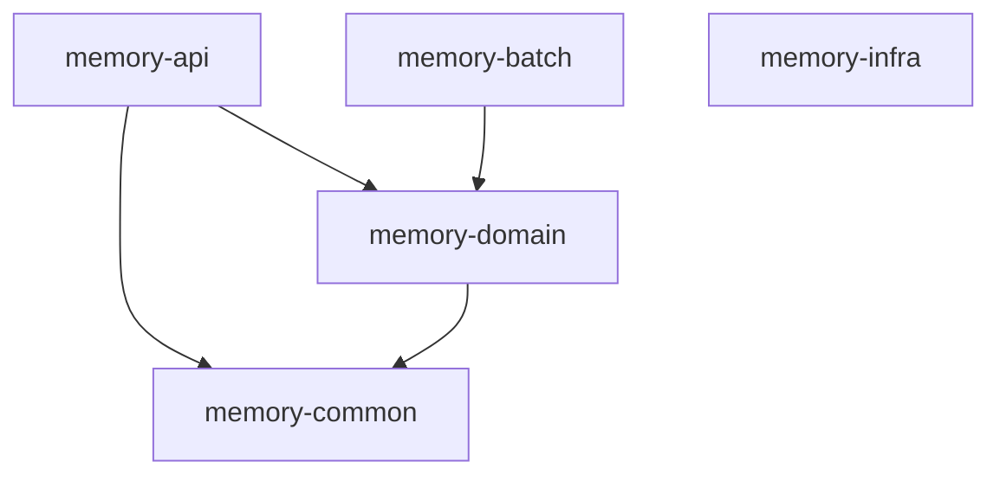

# Memory Project

## Overview
Memory는 지도 기반의 추억 공유 사이트로, 사용자들이 특정 위치에 자신의 추억을 기록하고 공유할 수 있는 서비스입니다.

## 🏗️ 프로젝트 아키텍처

### Domain-Driven Design Architecture
Memory 프로젝트는 DDD 원칙을 따르는 5개 모듈 구조입니다:

**모듈별 역할**:
- **memory-api**: Controllers, Business Services, UseCase (Application Layer)
- **memory-domain**: JPA Entities, Repositories, DTOs, QueryDSL (Domain Layer)
- **memory-common**: Cross-cutting concerns (JWT, security, AWS S3, exceptions, annotations)
- **memory-batch**: Spring Batch jobs and scheduling
- **memory-infra**: Docker configurations for different environments

### 전체 아키텍처 구조도

```
┌─────────────────────────────────────────────────────────────────┐
│                         CLIENT (Web/Mobile)                     │
└─────────────────────────┬───────────────────────────────────────┘
                          │ HTTP Request
                          ▼
┌─────────────────────────────────────────────────────────────────┐
│                      MEMORY-API MODULE                          │
├─────────────────────────────────────────────────────────────────┤
│  MemberController                                               │
│  ├── POST /api/members/register                                 │
│  └── MemberService (Business Logic)                             │
│      ├── 이메일 중복 검증                                        │
│      ├── 패스워드 정책 검증                                      │
│      └── Member 엔티티 생성/저장                                 │
└─────────────────────────┬───────────────────────────────────────┘
                          │ JPA Repository Call
                          ▼
┌─────────────────────────────────────────────────────────────────┐
│                    MEMORY-DOMAIN MODULE                         │
├─────────────────────────────────────────────────────────────────┤
│  Member (JPA Entity)                                           │
│  ├── @Id Long id                                               │
│  ├── @Column String email                                      │
│  ├── @Column String name                                       │
│  └── @Column String password                                   │
│                                                                 │
│  MemberRepository (extends JpaRepository)                      │
│  ├── Optional<Member> findByEmail(String email)                │
│  ├── boolean existsByEmail(String email)                       │
│  └── Custom QueryDSL methods                                   │
│                                                                 │
│  MemberRequest/Response DTOs                                    │
└─────────────────────────┬───────────────────────────────────────┘
                          │ Database Query
                          ▼
┌─────────────────────────────────────────────────────────────────┐
│                       DATABASE                                  │
├─────────────────────────────────────────────────────────────────┤
│  PostgreSQL + PostGIS                                          │
│  ├── members 테이블                                             │
│  ├── memories 테이블 (지리정보 포함)                             │
│  └── 기타 도메인 테이블들                                        │
└─────────────────────────────────────────────────────────────────┘

┌─────────────────────────────────────────────────────────────────┐
│                    MEMORY-COMMON MODULE                         │
├─────────────────────────────────────────────────────────────────┤
│  ├── @Auth, @MemberId 어노테이션                                │
│  ├── JWT 토큰 처리 (JwtComponent)                               │
│  ├── Spring Security 설정                                       │
│  ├── AWS S3 파일 업로드 (S3Service)                             │
│  └── 공통 예외 처리                                             │
└─────────────────────────────────────────────────────────────────┘
```

### 의존성 흐름도

```
memory-api ──────────→ memory-domain
    │                      ↑
    └─────→ memory-common ──┘
            ↑
memory-batch ┘
```

### 데이터 플로우 (회원가입 API 호출시)

```
1. Client Request
   POST /api/members/register
   {
     "email": "user@example.com",
     "password": "password123",
     "name": "홍길동"
   }
   ↓

2. API Layer (MemberController)
   - Request 데이터 검증
   - MemberService 호출
   ↓

3. Service Layer (MemberService)
   - 비즈니스 로직 실행
   - MemberRepository를 통한 중복 검증
   - Member 엔티티 생성 및 저장
   ↓

4. Domain Layer (MemberRepository + JPA)
   - JPA를 통한 데이터베이스 연산
   - QueryDSL 활용한 복잡한 쿼리 처리
   ↓

5. Database (PostgreSQL)
   - members 테이블에 데이터 저장
   - 트랜잭션 처리
   ↓

6. Response Flow (역방향)
   Database → JPA Entity → Service → Controller → Client
```

### 개발 순서 (MEMBER 회원가입 API 예시)

1. **Domain 계층**: Member JPA 엔티티, MemberRepository, Request/Response DTOs
2. **API 계층**: MemberService (비즈니스 로직), MemberController
3. **데이터베이스**: Flyway 마이그레이션 파일 작성
4. **테스트**: Service 단위 테스트, Controller 통합 테스트

### 핵심 원칙
- **의존성 방향**: API → Domain ← Common 방향으로 의존
- **Domain 특징**: JPA 엔티티와 Repository가 중심, QueryDSL로 타입 안전한 쿼리
- **Common 활용**: JWT, S3, 보안 설정 등 횡단 관심사 분리
- **테스트 전략**: Service 단위 테스트 → Controller 통합 테스트

### 멀티모듈 구조 (현재)
프로젝트는 Clean Architecture와 Hexagonal Architecture 원칙을 따라 5개의 모듈로 구성되어 있습니다:

```
memory/
├── memory-api/         # 🌐 Presentation Layer (Web)
├── memory-common/      # 🔧 Common Utilities & Infrastructure
├── memory-domain/      # 📊 Domain Layer & Data Access
├── memory-infra/       # 🐳 Infrastructure & DevOps
└── memory-batch/       # ⚡ Batch Processing
```

### 모듈별 상세 설명

#### 🌐 memory-api (Presentation Layer)
**역할**: 외부 요청을 받아 처리하는 웹 계층
- **실행 가능한 JAR**: 애플리케이션의 진입점
- **의존성**: `memory-common` ← `memory-domain`

**주요 구성요소**:
```
memory-api/
├── config/                         # Spring 설정 (CORS, Swagger 등)
├── controller/                     # REST API 컨트롤러
└── service/                        # 비즈니스 로직 서비스
```

#### 🔧 memory-common (Common Layer)
**역할**: 모든 모듈에서 공통으로 사용하는 기능들
- **라이브러리 JAR**: 다른 모듈에서 참조
- **의존성**: 다른 모듈들의 기반

**주요 구성요소**:
```
memory-common/
├── annotation/                     # 커스텀 어노테이션
├── component/
│   ├── jwt/                        # JWT 토큰 처리
│   ├── security/                   # 보안 컴포넌트
│   └── storage/                    # 파일 저장소 (S3)
├── config/
│   ├── security/SecurityConfig.java # Spring Security + CORS 설정
│   └── storage/S3Config.java       # AWS S3 설정
├── dto/                            # 공통 DTO
├── exception/                      # 공통 예외 클래스
├── response/                       # 공통 응답 포맷
└── service/                        # 공통 서비스 (파일 업로드 등)
```

#### 📊 memory-domain (Domain Layer)
**역할**: 도메인 모델과 데이터 액세스 로직
- **라이브러리 JAR**: 도메인 엔티티와 리포지토리 제공
- **의존성**: `memory-common`

**주요 구성요소**:
```
memory-domain/
├── config/
│   └── QueryDslConfig.java         # QueryDSL 설정
├── domain/
├── dto/                            # 도메인별 DTO
└── repository/                     # JPA Repository + QueryDSL
```

**기술 스택**:
- Spring Data JPA + PostgreSQL
- PostGIS (지리공간 데이터)
- QueryDSL (타입 안전 쿼리)
- Flyway (DB 마이그레이션)

#### 🐳 memory-infra (Infrastructure Layer)
**역할**: 인프라스트럭처 및 DevOps 도구
- **실행 불가능**: 설정 및 스크립트만 포함
- **의존성**: 없음 (독립적)

**주요 구성요소**:
```
memory-infra/
├── docker/
│   ├── local/                      # 로컬 개발 환경
│   │   └── docker-compose.yml      # PostgreSQL + PostGIS
│   ├── dev/                        # 개발 서버 환경
│   │   ├── docker-compose.yml      # App + DB + Nginx
│   │   └── nginx/                  # Nginx 설정
│   └── prod/                       # 프로덕션 환경
│       └── ec2/                    # AWS EC2 설정
│       └── ecs/                    # AWS ECS 설정 (추후 변경 예정)
└── build.gradle                    # Docker 태스크 정의
```

**Gradle 태스크**:
```bash
./gradlew memory-infra:localStart   # 로컬 환경 시작
./gradlew memory-infra:devStart     # 개발 환경 시작
./gradlew memory-infra:prodStart    # 프로덕션 환경 시작
```

#### ⚡ memory-batch (Batch Layer)
**역할**: 배치 처리 및 스케줄링
- **라이브러리 JAR**: 배치 작업 정의
- **의존성**: `memory-domain`

**주요 구성요소**:
```
memory-batch/
├── config/
│   ├── BatchConfig.java            # Spring Batch 설정
│   └── SchedulerConfig.java        # 스케줄러 설정
└── job/
    └── testJob/                    # 배치 작업 정의
```

### 의존성 그래프


## 🛠️ 기술 스택

### Backend
- **Java 17**: 프로그래밍 언어
- **Spring Boot 3.5.x**: 애플리케이션 프레임워크
- **Spring Security**: 보안 및 인증
- **Spring Data JPA**: 데이터 액세스
- **Spring Batch**: 배치 처리

### Database & Storage
- **PostgreSQL**: 메인 데이터베이스
- **PostGIS**: 지리공간 데이터 확장
- **AWS S3**: 파일 저장소
- **Flyway**: 데이터베이스 마이그레이션

### Infrastructure & DevOps
- **Docker & Docker Compose**: 컨테이너화
- **Nginx**: 리버스 프록시
- **AWS ECS**: 컨테이너 오케스트레이션
- **GitHub Actions**: CI/CD

### Development & Documentation
- **QueryDSL**: 타입 안전 쿼리
- **JWT**: 토큰 기반 인증
- **Swagger/OpenAPI**: API 문서화
- **Lombok**: 코드 생성

## 🚀 개발 환경 설정

### 사전 요구사항
- Java 17
- Docker & Docker Compose
- Gradle

### 로컬 개발 환경 구축

1. **저장소 클론**:
   ```bash
   git clone https://github.com/yourusername/memory.git
   cd memory
   ```

2. **인프라 환경 시작** (PostgreSQL + PostGIS):
   ```bash
   ./gradlew memory-infra:localStart
   ```

3. **프로젝트 빌드**:
   ```bash
   ./gradlew build
   ```

4. **애플리케이션 실행**:
   ```bash
   ./gradlew memory-api:bootRun
   ```

5. **API 문서 확인**:
   ```
   http://localhost:8080/swagger-ui.html
   ```

### 환경별 Docker 명령어
```bash
# 로컬 환경
./gradlew memory-infra:localStart    # 시작
./gradlew memory-infra:localStop     # 중지

# 개발 환경  
./gradlew memory-infra:devStart      # 시작
./gradlew memory-infra:devStop       # 중지

# 프로덕션 환경
./gradlew memory-infra:prodStart     # 시작
./gradlew memory-infra:prodStop      # 중지

# Docker 리소스 정리
./gradlew memory-infra:cleanDocker
```

## 🧪 테스트

### HTTP 클라이언트 파일
`http/` 디렉토리에는 API 테스트를 위한 HTTP 클라이언트 파일들이 도메인별로 정리되어 있습니다:

```
http/
├── member/member.http              # 회원 관련 API 테스트
├── map/map.http                    # 지도 관련 API 테스트  
├── memory/memory.http              # 추억 관련 API 테스트
├── file/file.http                  # 파일 업로드 테스트
├── game/                           # 게임 관련 API 테스트
├── ...
└── http-client.env.json            # 환경 변수 설정
```

IntelliJ IDEA의 HTTP Client나 VS Code의 REST Client 확장으로 사용할 수 있습니다.

### 단위 테스트 실행
```bash
./gradlew test                      # 전체 테스트 실행
./gradlew memory-api:test           # API 모듈 테스트만 실행
./gradlew memory-domain:test        # 도메인 모듈 테스트만 실행
```

## 🔄 CI/CD

### 개발 서버
`.github/workflows` 디렉토리의 GitHub Actions 워크플로우:

- **build-push.yml**: 애플리케이션 빌드 및 Docker 이미지 푸시
- **deploy-dev.yml**: 개발 환경 자동 배포
- **run-tests.yml**: 자동화된 테스트 실행

### 프로덕션 서버
프로덕션 환경은 AWS PIPELINE을 통해 관리되며, EC2 인스턴스에 배포됩니다.

## 📁 프로젝트 구조 상세

### 전체 디렉토리 구조
```
memory/
├── .github/                        # GitHub 설정
│   └── workflows/                  # CI/CD 파이프라인
├── http/                           # API 테스트 파일
├── memory-api/                     # 🌐 웹 계층
├── memory-common/                  # 🔧 공통 계층
├── memory-domain/                  # 📊 도메인 계층
├── memory-infra/                   # 🐳 인프라 계층
├── memory-batch/                   # ⚡ 배치 계층
├── build.gradle                    # 루트 빌드 설정
├── settings.gradle                 # 모듈 설정
└── README.md                       # 프로젝트 문서
```

## 📝 License

This project is licensed under the MIT License - see the LICENSE file for details.
