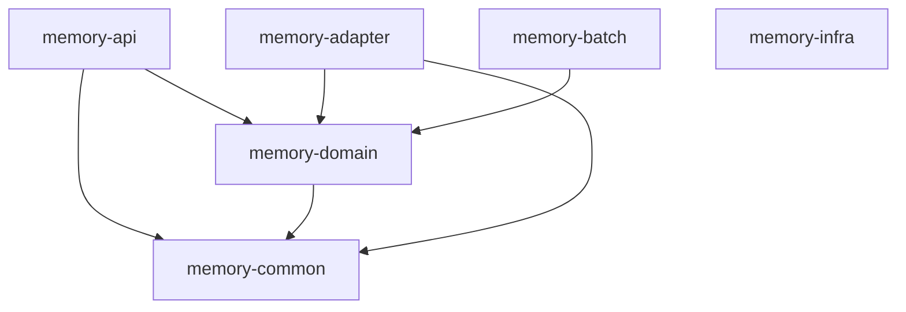

# 멀티모듈 구조

프로젝트는 Clean Architecture와 Hexagonal Architecture 원칙을 따라 6개의 모듈로 구성되어 있습니다:

```
memory/
├── memory-api/         # 🌐 Presentation Layer (Web + DTOs)
├── memory-domain/      # 🎯 Domain Layer (Entities + Interfaces)  
├── memory-adapter/     # 🔌 Infrastructure Layer (Implementations)
├── memory-common/      # 🔧 Common Utilities & Cross-cutting
├── memory-batch/       # ⚡ Batch Processing
└── memory-infra/       # 🐳 Infrastructure & DevOps
```

## 모듈별 상세 설명

### 🌐 memory-api (Presentation Layer)
**역할**: 외부 요청을 받아 처리하는 웹 계층 + API 계약 정의
- **실행 가능한 JAR**: 애플리케이션의 진입점
- **의존성**: `memory-common` ← `memory-domain`

**주요 구성요소**:
```
memory-api/
├── config/                         # Spring 설정 (CORS, Swagger 등)
├── controller/                     # REST API 컨트롤러
├── service/                        # 비즈니스 로직 서비스
└── dto/                            # Request/Response DTOs (API 계약)
    ├── member/                     # 회원 관련 DTO
    ├── memory/                     # 추억 관련 DTO
    └── relationship/               # 관계 관련 DTO
```

### 🎯 memory-domain (Domain Layer) 
**역할**: 순수 도메인 모델과 비즈니스 규칙
- **라이브러리 JAR**: 도메인 엔티티와 인터페이스 제공
- **의존성**: `memory-common`

**주요 구성요소**:
```
memory-domain/
├── domain/                         # JPA 엔티티
│   ├── member/Member.java          # 회원 엔티티
│   ├── memory/Memory.java          # 추억 엔티티
│   └── BaseTimeEntity.java         # 공통 베이스 엔티티
├── repository/                     # Repository 인터페이스 (구현체 없음)
└── dto/search/                     # 도메인 특화 DTO (ElasticSearch)
```

### 🔌 memory-adapter (Infrastructure Layer)
**역할**: 외부 시스템 연동 및 기술적 구현체
- **라이브러리 JAR**: Repository 구현체와 외부 시스템 어댑터
- **의존성**: `memory-domain`

**주요 구성요소**:
```
memory-adapter/
├── persistence/repository/         # JPA Repository 구현체
│   ├── member/MemberRepositoryCustomImpl.java
│   └── memory/MemoryRepositoryCustomImpl.java
├── search/repository/              # ElasticSearch Repository 구현체  
├── storage/service/                # S3 파일 업로드 서비스
├── config/                         # 기술적 설정 (JPA, S3, ElasticSearch)
└── src/main/resources/             # 설정 파일
```

### 🔧 memory-common (Common Layer)
**역할**: 횡단 관심사 및 공통 유틸리티
- **라이브러리 JAR**: 다른 모듈에서 참조
- **의존성**: 다른 모듈들의 기반

**주요 구성요소**:
```
memory-common/
├── annotation/                     # 커스텀 어노테이션 (@Auth, @MemberId)
├── component/
│   ├── jwt/                        # JWT 토큰 처리
│   └── security/                   # 보안 컴포넌트
├── config/security/                # Spring Security + CORS 설정
├── exception/                      # 공통 예외 클래스
├── response/                       # 공통 응답 포맷
└── util/                           # 공통 유틸리티
```

### 🐳 memory-infra (Infrastructure Layer)
**역할**: 인프라스트럭처 및 DevOps 도구
- **실행 불가능**: 설정 및 스크립트만 포함
- **의존성**: 없음 (독립적)

**주요 구성요소**:
```
memory-infra/
├── docker/
│   ├── local/                      # 로컬 개발 환경
│   │   └── docker-compose.yml      # PostgreSQL + PostGIS
│   ├── dev/                        # 개발 서버 환경
│   │   ├── docker-compose.yml      # App + DB + Nginx
│   │   └── nginx/                  # Nginx 설정
│   └── prod/                       # 프로덕션 환경
│       └── ec2/                    # AWS EC2 설정
│       └── ecs/                    # AWS ECS 설정 (추후 변경 예정)
└── build.gradle                    # Docker 태스크 정의
```

**Gradle 태스크**:
```bash
./gradlew memory-infra:localStart   # 로컬 환경 시작
./gradlew memory-infra:devStart     # 개발 환경 시작
./gradlew memory-infra:prodStart    # 프로덕션 환경 시작
```

### ⚡ memory-batch (Batch Layer)
**역할**: 배치 처리 및 스케줄링
- **라이브러리 JAR**: 배치 작업 정의
- **의존성**: `memory-domain`

**주요 구성요소**:
```
memory-batch/
├── config/
│   ├── BatchConfig.java            # Spring Batch 설정
│   └── SchedulerConfig.java        # 스케줄러 설정
└── job/
    └── testJob/                    # 배치 작업 정의
```

## 의존성 그래프
